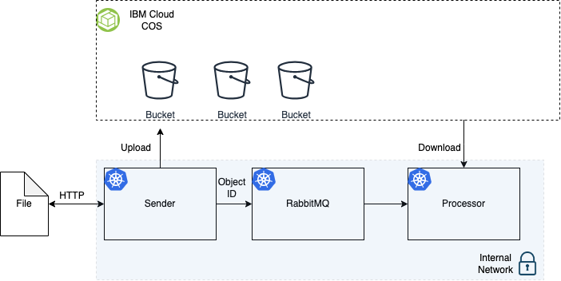

# RabbitMQ
This project aims to provide a practical implementation of a basic queue system using the RabbitMQ messaging broker. The system consists of three applications: Sender, RabbitMQ, and Processor.

The Sender application is responsible for receiving files, storing them in the IBM Cloud Object Storage (COS), and sending the file's ID to the RabbitMQ queue. This application acts as a producer, as it generates messages and sends them to the queue for further processing. Upon receiving a file, the Sender application saves it in the IBM COS, ensuring secure and reliable storage.

The RabbitMQ messaging broker plays a crucial role in this project. It acts as an intermediary between the Sender and Processor applications, facilitating communication and ensuring reliable message delivery. RabbitMQ receives the file IDs from the Sender application and stores them in a queue. The queue holds the messages until they are consumed by the Processor application.

The Processor application is responsible for retrieving the file names from the queue and downloading the corresponding files from the IBM COS using the file IDs obtained from RabbitMQ. This application acts as a consumer, as it consumes messages from the queue and performs the necessary processing tasks. The Processor application downloads the files based on the information received from the queue and carries out further operations as required.

By implementing this queue-based system, I seeked to can gain valuable skills and insights into using message queues for handling asynchronous communication and decoupling different components of an application. The project provides me a foundation for understanding how to leverage RabbitMQ and IBM COS to build robust and scalable systems that can efficiently handle file processing tasks.

## Application Architecture

## How to run the applcation
This application was created to be easy to change and very easy to run, it was meant to be a microservice.

If you just want RabitMQ, delete all the things that are related to IBM Cloud Oject Storage. Go to `./source/sender` and create a new `.env` file based on the examples provided called `.env.example` and fill the required credentials. Replicate the same process on `./source/processor`, after that you are ready to start the application.
To start this application go to `./source` and run `Docker compose up -d` on your terminal.

